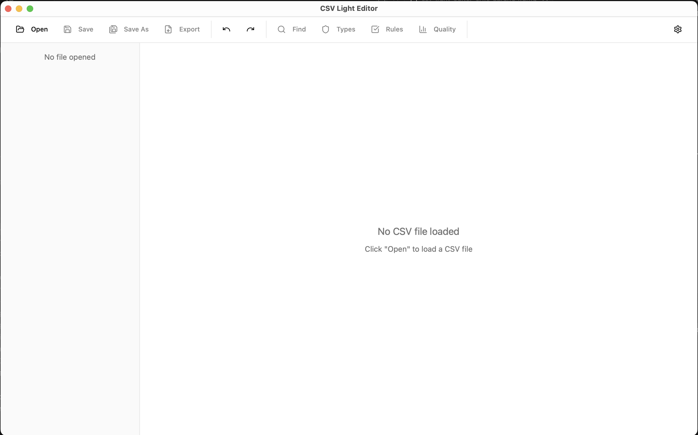
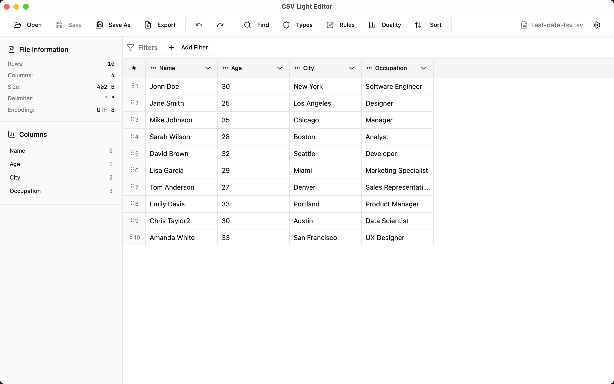
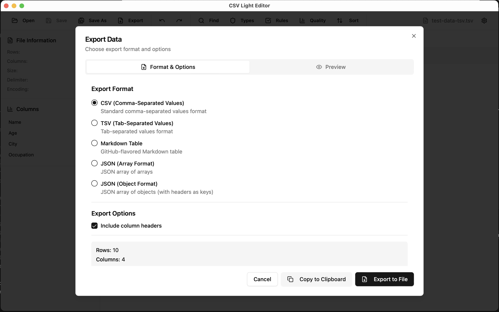

# CSV Light Editor

A high-performance CSV editing application for Mac, built with Tauri and React.

## Overview

CSV Light Editor is a lightweight yet powerful desktop application designed to handle CSV files efficiently. Built with Rust backend (Tauri) and React frontend, it provides a smooth editing experience even with large datasets.

## Features

- **Fast File Loading**: Efficiently load and process CSV files of various sizes
- **Intuitive Table View**: Clean, spreadsheet-like interface for viewing and editing data
- **File Information Panel**: Quick access to file metadata including row count, column count, file size, delimiter, and encoding
- **Advanced Filtering**: Apply filters to narrow down data
- **Sorting & Search**: Sort columns and search across your data
- **Data Quality Tools**: Built-in quality checks and validation rules
- **Multiple Export Formats**: Export data to CSV, TSV, Markdown tables, or JSON (array/object format)
- **Column Management**: View and manage all columns at a glance

## Screenshots


*Initial screen with no file loaded*


*CSV file loaded with table view and file information panel*


*Export data in multiple formats*

## Technology Stack

- **Backend**: Rust with Tauri v1
- **Frontend**: React 19 with TypeScript
- **UI Components**: shadcn/ui
- **Styling**: Tailwind CSS

## Development

```bash
cd app
pnpm install        # Install dependencies
pnpm tauri dev      # Run development server
```

## Build

```bash
cd app
pnpm build          # Build frontend
pnpm tauri build    # Build release version
```
