# AIチャットからPythonスクリプト実行までのフロー

## 概要

CSV Light Editorでは、ユーザーがAIチャットでプロンプトを入力すると、LLM（OpenAI/Gemini）がPythonスクリプトを生成し、実行して結果をフロントエンドに返します。このドキュメントでは、その一連のフローを詳しく説明します。

## システムアーキテクチャ

```mermaid
sequenceDiagram
    participant User
    participant ChatPanel as ChatPanel<br/>(Frontend)
    participant TauriIPC as Tauri IPC
    participant AiCommands as ai.rs<br/>(Commands)
    participant Generator as ScriptGenerator<br/>(generator.rs)
    participant LLM as LLM Client<br/>(OpenAI/Gemini)
    participant Executor as ScriptExecutor<br/>(executor.rs)
    participant Python as Python3 Process
    participant ChatStore as ChatStore<br/>(State)

    Note over User,ChatStore: 1. ユーザープロンプト入力とスクリプト生成フェーズ

    User->>ChatPanel: プロンプト入力 & 送信
    ChatPanel->>ChatStore: addMessage(userMessage)
    ChatPanel->>ChatPanel: setIsGenerating(true)

    ChatPanel->>TauriIPC: invoke("generate_script", {<br/>prompt, csvContext, sampleRows})
    TauriIPC->>AiCommands: generate_script()

    AiCommands->>AiCommands: analyze_csv_columns()<br/>(カラム型検出)
    Note right of AiCommands: サンプル5行でカラム情報分析<br/>- データ型検出<br/>- 日時フォーマット検出<br/>- サンプル値抽出

    AiCommands->>Generator: generate_script(prompt, context)
    Generator->>Generator: detect_script_type(prompt)
    Note right of Generator: キーワード分析により判定:<br/>- Analysis (分析・集計)<br/>- Transformation (変換・修正)

    Generator->>LLM: generate_script(prompt, context)
    Note right of LLM: API呼び出し:<br/>- OpenAI: gpt-4o-mini<br/>- Gemini: gemini-2.0-flash-exp

    LLM-->>Generator: Pythonコード（本体のみ）
    Generator->>Generator: wrap_in_template(code)
    Note right of Generator: テンプレート埋め込み:<br/>- stdin読み込み処理<br/>- JSON入出力処理<br/>- エラーハンドリング

    Generator-->>AiCommands: Script
    AiCommands-->>TauriIPC: GenerateScriptResponse
    TauriIPC-->>ChatPanel: {script, scriptType, requiresApproval}

    ChatPanel->>ChatStore: addMessage(assistantMessage + script)
    ChatPanel->>ChatPanel: setIsGenerating(false)

    alt Script Type: Analysis
        Note over ChatPanel: 分析スクリプトは自動実行
        ChatPanel->>ChatPanel: handleExecuteScript(script, false)
    else Script Type: Transformation
        Note over ChatPanel: 変換スクリプトは承認待ち
        ChatPanel->>ChatStore: setPendingScript(script)
        ChatPanel->>User: "Approve & Execute" ボタン表示
        User->>ChatPanel: 承認ボタンクリック
        ChatPanel->>ChatPanel: handleExecuteScript(script, true)
    end

    Note over User,ChatStore: 2. スクリプト実行とプログレス追跡フェーズ

    ChatPanel->>ChatPanel: setIsExecuting(true)
    ChatPanel->>TauriIPC: invoke("execute_script", {<br/>script, approval, csvData})
    TauriIPC->>AiCommands: execute_script()

    AiCommands->>Executor: execute_script(script, headers, rows)

    Executor->>Executor: security_validator.validate_script()
    Note right of Executor: セキュリティ検証:<br/>- 禁止関数チェック<br/>- ファイルI/Oチェック<br/>- ネットワーク操作チェック

    Executor->>Executor: create_temp_script(content)
    Note right of Executor: 一時ファイル作成:<br/>/tmp/csv_script_<uuid>.py

    Executor->>Python: spawn("python3 -u script.py")
    Note right of Python: プロセス起動:<br/>- stdin: パイプ (CSV data input)<br/>- stdout: パイプ (result output)<br/>- stderr: パイプ (error output)

    Executor->>Python: Write CSV data to stdin<br/>(JSON format)
    Note right of Executor: CSVデータ送信:<br/>{headers: [...], rows: [...]}

    Python->>Python: _read_json_input()
    Python->>Python: ユーザーコード実行

    loop プログレス送信 (オプション)
        Python->>Executor: stdout: {"type": "progress",<br/>"processed": N, "total": M, "step": "..."}
        Executor->>Executor: update progress tracker
        Executor->>TauriIPC: emit("script-progress", {...})
        TauriIPC->>ChatPanel: script-progress event
        ChatPanel->>ChatStore: setExecutionProgress(progress)
        ChatPanel->>User: ProgressIndicator表示
    end

    Python->>Python: _safe_print(result)
    Python->>Executor: stdout: {"type": "analysis/transformation",<br/>"summary": "...", "details": {...}}
    Python->>Executor: プロセス終了 (exit code 0)

    alt 実行成功
        Executor->>Executor: parse_result(output)
        Note right of Executor: 結果パース:<br/>- Analysis: summary + details<br/>- Transformation: changes + preview

        Executor-->>AiCommands: ExecutionResult {<br/>executionId, result, changes}
        AiCommands-->>TauriIPC: ExecuteScriptResponse
        TauriIPC-->>ChatPanel: {executionId, result, changes}

        ChatPanel->>ChatStore: addMessage(resultMessage)
        ChatPanel->>ChatPanel: setIsExecuting(false)
        ChatPanel->>User: 結果表示
    else 実行エラー
        Python->>Executor: stderr: エラーメッセージ
        Python->>Executor: プロセス終了 (exit code != 0)

        Executor->>Executor: parse_python_error(stderr)
        Note right of Executor: エラー解析:<br/>- IndentationError<br/>- SyntaxError<br/>- ValueError<br/>- KeyError, etc.

        Executor-->>AiCommands: ExecutionResult {<br/>result: Error}
        AiCommands-->>TauriIPC: ExecuteScriptResponse<br/>{result: {type: "error", message}}
        TauriIPC-->>ChatPanel: Error result

        alt 自動修正試行 (リトライ < 2回)
            Note over ChatPanel: 自動修正フロー
            ChatPanel->>ChatStore: addMessage("Auto-fix attempt...")
            ChatPanel->>TauriIPC: invoke("fix_script", {<br/>originalPrompt, originalScript, errorMessage})
            TauriIPC->>AiCommands: fix_script()
            AiCommands->>Generator: fix_script(prompt, script, error)

            Generator->>Generator: 修正プロンプト作成<br/>(元プロンプト + エラー情報)
            Generator->>LLM: generate_script(fixPrompt, context)
            LLM-->>Generator: 修正されたPythonコード
            Generator->>Generator: wrap_in_template(code)
            Generator-->>AiCommands: 修正されたScript
            AiCommands-->>TauriIPC: GenerateScriptResponse
            TauriIPC-->>ChatPanel: Fixed script

            ChatPanel->>ChatPanel: handleExecuteScript(fixedScript, approval)
            Note right of ChatPanel: リトライカウント+1で再実行
        else リトライ上限
            ChatPanel->>ChatStore: addMessage(errorMessage)
            ChatPanel->>ChatPanel: setIsExecuting(false)
            ChatPanel->>User: エラーメッセージ表示
        end
    end

    Note over User,ChatStore: 3. チャット履歴保存フェーズ

    ChatPanel->>TauriIPC: invoke("save_chat_history", {<br/>csvPath, history})
    TauriIPC->>AiCommands: save_chat_history()
    AiCommands->>AiCommands: metadata_manager.save_chat_history()
    Note right of AiCommands: 履歴保存:<br/><csv_file>.csvmeta<br/>(JSON形式)
    AiCommands-->>TauriIPC: SaveChatHistoryResponse
    TauriIPC-->>ChatPanel: {success: true}

    ChatPanel->>ChatStore: setCurrentHistory(updatedHistory)
```



## 主要なコンポーネント

### フロントエンド

#### ChatPanel (app/src/components/chat/ChatPanel.tsx)

チャットUIの中核コンポーネント。主な責務:

- **ユーザー入力処理**: プロンプトの送信と検証
- **スクリプト生成**: `generate_script` コマンド呼び出し
- **スクリプト実行**: `execute_script` コマンド呼び出し
- **プログレス追跡**: `script-progress` イベントリスニング
- **自動修正**: エラー時の `fix_script` 呼び出し (最大2回)
- **チャット履歴**: 自動保存 (1秒デバウンス)

**主要メソッド**:
- `handleSubmit()` - ユーザープロンプト送信
- `handleExecuteScript()` - スクリプト実行と結果処理
- `saveChatHistory()` - チャット履歴保存

#### ChatStore (app/src/store/chatStore.ts)

チャット状態管理。Zustandベース。

**状態**:
- `messages: ChatMessage[]` - チャットメッセージ履歴
- `currentHistory: ChatHistory | null` - 現在のファイルの履歴
- `pendingScript: Script | null` - 承認待ちスクリプト
- `executionProgress: ExecutionProgress | null` - 実行進捗
- `isExecuting: boolean` - 実行中フラグ

### バックエンド (Rust)

#### ai.rs (app/src-tauri/src/commands/ai.rs)

Tauriコマンドハンドラ。主なコマンド:

##### `generate_script`

**入力**:
```typescript
{
  prompt: string,
  csvContext: ExecutionContext,
  sampleRows?: string[][]
}
```

**処理**:
1. `analyze_csv_columns()` - サンプル行からカラム情報を分析
2. `ScriptGenerator.generate_script()` - LLMでスクリプト生成
3. スクリプトタイプに応じて承認フラグを設定

**出力**:
```typescript
{
  script: Script,
  scriptType: "analysis" | "transformation",
  requiresApproval: boolean
}
```

##### `execute_script`

**入力**:
```typescript
{
  script: Script,
  approval: boolean,
  csvData: { headers: string[], rows: string[][] }
}
```

**処理**:
1. 承認チェック (transformationの場合)
2. `ScriptExecutor.execute_script()` - Python実行
3. 結果パースと返却

**出力**:
```typescript
{
  executionId: string,
  result: ResultPayload,
  changes?: DataChange[]
}
```

##### `fix_script`

**入力**:
```typescript
{
  originalPrompt: string,
  originalScript: Script,
  errorMessage: string,
  csvContext: ExecutionContext,
  sampleRows?: string[][]
}
```

**処理**:
1. エラー情報を含む修正プロンプト作成
2. `ScriptGenerator.fix_script()` - LLMで修正スクリプト生成

**出力**: `generate_script` と同じ

##### `save_chat_history` / `load_chat_history`

**機能**: チャット履歴の永続化 (`.csvmeta` ファイル)

#### generator.rs (app/src-tauri/src/ai_script/generator.rs)

Pythonスクリプト生成を担当。

**主要メソッド**:

##### `generate_script(prompt, context)`

1. **スクリプトタイプ検出**: キーワードベース
   - Transformation: "変更", "変換", "修正", "change", "transform", etc.
   - Analysis: "分析", "計算", "統計", "analyze", "calculate", etc.

2. **LLM呼び出し**: OpenAI/Geminiクライアント経由

3. **テンプレート埋め込み**: `wrap_in_template()`
   - stdin読み込み処理 (`_read_json_input()`)
   - JSON出力処理 (`_safe_print()`)
   - エラーハンドリング
   - ユーザーコードをインデント調整して挿入

**生成されるスクリプト構造**:
```python
# CSV Light Editor - Generated Script
# User Request: <prompt>
# Generated: <timestamp>
# Script Type: analysis/transformation

import sys
import json
from datetime import datetime
from typing import List, Dict, Any

def _read_json_input() -> Dict[str, Any]:
    # stdin から JSON データを読み込み
    ...

def _safe_print(payload: Dict[str, Any]) -> None:
    # 結果を JSON として出力
    ...

def main():
    try:
        input_data = _read_json_input()
        headers = input_data.get('headers', [])
        rows = input_data.get('rows', [])
    except Exception as e:
        _safe_print({'type': 'error', 'message': f'Failed to parse input: {e}'})
        return

    script_type = 'analysis' or 'transformation'

    # ===== ユーザーコード (LLM生成部分) =====
    # ... ユーザーのリクエストに応じた処理 ...
    # ... summary, details または changes, preview を生成 ...
    # ========================================

    try:
        if script_type == 'analysis':
            result = {
                'type': 'analysis',
                'summary': summary,
                'details': details
            }
        else:
            result = {
                'type': 'transformation',
                'changes': changes,
                'preview': preview
            }
        _safe_print(result)
    except Exception as e:
        _safe_print({'type': 'error', 'message': f'Execution error: {e}'})

if __name__ == "__main__":
    main()
```

##### `fix_script(originalPrompt, script, error, context)`

エラー情報を元プロンプトに追加して再生成:
```
<original_prompt>

IMPORTANT: The previous script failed with this error:
<error_message>

Please generate a corrected version that fixes this issue. Pay special attention to:
- Date/time format matching
- Column names and indices
- Data types and conversions
- Indentation and syntax
```

#### executor.rs (app/src-tauri/src/ai_script/executor.rs)

Pythonスクリプトの実行を担当。

**主要メソッド**:

##### `execute_script(script, headers, rows, window)`

実行フロー:

1. **セキュリティ検証** (`security_validator.validate_script()`)
   - 禁止関数チェック: `open()`, `exec()`, `eval()`, `__import__()`
   - ファイルI/O: `os.`, `shutil.`, `pathlib.`
   - ネットワーク: `urllib`, `requests`, `socket`

2. **一時ファイル作成** (`create_temp_script()`)
   - `/tmp/csv_script_<uuid>.py`

3. **Pythonプロセス起動**
   ```rust
   Command::new("python3")
       .arg("-u")  // Unbuffered output
       .arg(&script_path)
       .stdin(Stdio::piped())
       .stdout(Stdio::piped())
       .stderr(Stdio::piped())
       .env("PYTHONPATH", "")  // Restrict imports
       .env("PYTHONDONTWRITEBYTECODE", "1")
       .spawn()
   ```

4. **CSVデータ送信** (stdin)
   ```json
   {
     "headers": ["col1", "col2", ...],
     "rows": [["val1", "val2", ...], ...]
   }
   ```

5. **出力ストリーミング** (stdout)
   - プログレス更新を検出: `{"type": "progress", ...}`
   - Tauriイベント発火: `script-progress`
   - 最終結果を解析: `{"type": "analysis/transformation", ...}`

6. **エラー処理** (stderr)
   - `parse_python_error()` で詳細解析
   - ユーザーフレンドリーなメッセージ生成

7. **結果返却**
   ```rust
   ExecutionResult {
       execution_id: String,
       started_at: DateTime<Utc>,
       completed_at: Option<DateTime<Utc>>,
       result: ResultPayload,
       error: Option<String>,
   }
   ```

**プログレス追跡**:

Pythonスクリプトから以下の形式で進捗を出力可能:
```python
print(json.dumps({
    "type": "progress",
    "processed": 100,
    "total": 1000,
    "step": "Calculating statistics..."
}))
```

これにより:
1. Executorがプログレスを検出
2. Tauriイベント `script-progress` を発火
3. フロントエンドが `ProgressIndicator` を更新

### データ型

#### Script (models.rs)

```rust
pub struct Script {
    pub id: String,
    pub content: String,
    pub script_type: ScriptType,  // Analysis | Transformation
    pub generated_at: DateTime<Utc>,
    pub user_prompt: String,
    pub execution_state: ExecutionState,  // Pending | Running | Completed | Failed
    pub execution_result: Option<ExecutionResult>,
}
```

#### ResultPayload (models.rs)

```rust
pub enum ResultPayload {
    Analysis {
        summary: String,
        details: serde_json::Value,
    },
    Transformation {
        changes: Vec<DataChange>,
        preview: Vec<ChangePreview>,
    },
    Error {
        message: String,
    },
}
```

#### ExecutionContext (models.rs)

```rust
pub struct ExecutionContext {
    pub csv_path: Option<String>,
    pub headers: Vec<String>,
    pub row_count: usize,
    pub selected_range: Option<SelectionRange>,
    pub filter_state: Option<serde_json::Value>,
    pub sort_state: Option<serde_json::Value>,
    pub column_info: Option<Vec<ColumnInfo>>,  // 型検出結果
}
```

#### ColumnInfo (models.rs)

カラムの型情報（サンプル行から検出）:

```rust
pub struct ColumnInfo {
    pub column_index: usize,
    pub column_name: String,
    pub detected_type: String,  // "integer", "float", "date", "datetime", "text", etc.
    pub format: Option<String>,  // For datetime: "%Y-%m-%d %H:%M"
    pub sample_values: Vec<String>,  // First 5 non-empty values
}
```

## エラーハンドリングと自動修正

### 自動修正フロー

スクリプト実行でエラーが発生した場合:

1. **エラー検出**: `ResultPayload::Error` が返される
2. **リトライチェック**: `retryCount < 2` なら自動修正
3. **修正プロンプト生成**: エラーメッセージを追加
4. **修正スクリプト生成**: `fix_script` コマンド呼び出し
5. **再実行**: 修正されたスクリプトで再度実行
6. **リトライカウント更新**: `retryCount + 1`

最大2回まで自動修正を試行。それでも失敗した場合はユーザーにエラーを表示。

### エラー解析 (parse_python_error)

Pythonエラーを解析してユーザーフレンドリーなメッセージを生成:

- **IndentationError**: インデント不整合
- **SyntaxError**: 構文エラー
- **NameError**: 未定義変数
- **TypeError**: 型不一致
- **ValueError**: データ形式エラー (特に日時フォーマット)
- **KeyError**: カラム名不一致
- **IndexError**: インデックス範囲外

各エラーに対して、原因と対処法を含むメッセージを生成。

## チャット履歴の永続化

### 保存タイミング

- **自動保存**: メッセージ変更時 (1秒デバウンス)
- **手動保存**: スクリプト実行完了後

### 保存先

- **ファイル**: `<csv_file_path>.csvmeta`
- **フォーマット**: JSON

### データ構造

```json
{
  "csvPath": "/path/to/data.csv",
  "messages": [
    {
      "id": "user-1234567890",
      "role": "user",
      "content": "Show me statistics for the price column",
      "timestamp": "2025-01-01T00:00:00Z"
    },
    {
      "id": "assistant-1234567891",
      "role": "assistant",
      "content": "I've generated an analysis script.",
      "timestamp": "2025-01-01T00:00:01Z",
      "script": {
        "id": "uuid",
        "content": "...",
        "scriptType": "analysis",
        "generatedAt": "2025-01-01T00:00:01Z",
        "userPrompt": "Show me statistics for the price column",
        "executionState": "completed",
        "executionResult": {
          "executionId": "uuid",
          "startedAt": "2025-01-01T00:00:02Z",
          "completedAt": "2025-01-01T00:00:03Z",
          "result": {
            "type": "analysis",
            "summary": "Statistics for price column:\n...",
            "details": {...}
          }
        }
      },
      "metadata": {
        "messageType": "analysis"
      }
    }
  ],
  "createdAt": "2025-01-01T00:00:00Z",
  "updatedAt": "2025-01-01T00:00:10Z"
}
```

### ロード

CSVファイルを開いた際に自動ロード:

1. `useEffect` でファイルパス変更を検知
2. `load_chat_history` コマンド呼び出し
3. 履歴が存在すれば `ChatStore` に設定
4. 存在しなければ空の履歴で初期化

## セキュリティ

### スクリプト検証 (SecurityValidator)

実行前に以下をチェック:

1. **禁止関数**:
   - `open()`, `file()` - ファイルI/O
   - `exec()`, `eval()`, `compile()` - 動的コード実行
   - `__import__()`, `importlib` - 動的インポート

2. **禁止モジュール**:
   - `os.`, `shutil.`, `pathlib.` - ファイルシステム操作
   - `subprocess.`, `multiprocessing.` - プロセス実行
   - `urllib`, `requests`, `socket` - ネットワーク操作

3. **環境変数制限**:
   - `PYTHONPATH=""` - モジュールパス制限
   - `PYTHONDONTWRITEBYTECODE=1` - .pyc作成防止

### stdin/stdoutによるデータ隔離

- CSVデータは **stdin** 経由でのみ渡される
- ファイルシステムには一切アクセスしない
- 結果は **stdout** 経由でのみ返される

## パフォーマンス最適化

### サンプル行による型検出

- フルデータではなく **先頭5行** のみをLLMに送信
- カラム型情報を事前に分析して送信
- LLMのトークン使用量を削減

### プログレッシブ実行

- 長時間実行時は進捗をリアルタイムで通知
- ユーザーはキャンセル可能 (`cancel_script_execution`)

### デバウンス保存

- チャット履歴の保存を1秒デバウンス
- 頻繁な保存を防止

## トラブルシューティング

### よくあるエラー

1. **"API key not configured"**
   - `.env` ファイルでAPIキーを設定
   - `AI_MODEL_PROVIDER` と `AI_API_KEY_<PROVIDER>` を設定

2. **"Failed to start Python process"**
   - `python3` がインストールされているか確認
   - PATHが通っているか確認

3. **"Script contains potentially unsafe operations"**
   - セキュリティ検証でブロックされた
   - 禁止関数/モジュールを使用していないか確認

4. **日時フォーマットエラー**
   - 自動修正が実データフォーマットを検出して修正を試みる
   - 最大2回まで自動修正を試行

### デバッグ

Rustログを有効化:
```bash
RUST_LOG=info pnpm tauri dev
```

重要なログポイント:
- `[GENERATOR]` - スクリプト生成
- `[EXECUTE]` - 実行フロー
- `[INTERNAL]` - Python実行詳細
- `[COMMAND]` - Tauriコマンド

## まとめ

このシステムは以下の特徴があります:

1. **AIベースのスクリプト生成**: ユーザーの自然言語プロンプトからPythonスクリプトを生成
2. **安全な実行環境**: セキュリティ検証とサンドボックス化
3. **リアルタイム進捗**: プログレスイベントによるフィードバック
4. **自動エラー修正**: 最大2回までエラーから自動回復
5. **永続化**: チャット履歴の自動保存・ロード
6. **型認識**: CSVカラムの型を自動検出してLLMに提供

これにより、ユーザーは複雑なPythonコードを書かずに、自然言語でデータ分析・変換を実行できます。