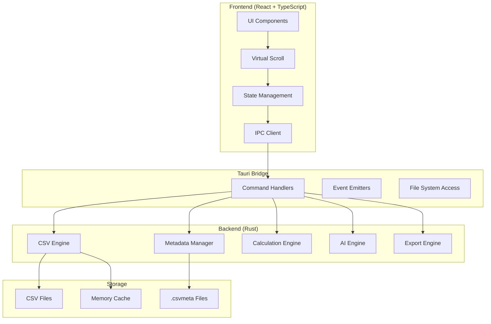

# CSV Light Editor - 技術アーキテクチャ設計書

## システム全体構成



## コンポーネント詳細設計

### 1. Rustバックエンド

#### 1.1 CSV処理エンジン

```rust
// src-tauri/src/csv_engine/mod.rs

use std::sync::Arc;
use tokio::sync::RwLock;
use csv_async::{AsyncReader, AsyncWriter};

pub struct CsvEngine {
    file_path: Option<String>,
    data: Arc<RwLock<CsvData>>,
    metadata: Arc<RwLock<Metadata>>,
    cache: Arc<Cache>,
}

pub struct CsvData {
    headers: Vec<String>,
    rows: Vec<Row>,
    total_rows: usize,
    loaded_ranges: Vec<Range>,
}

pub struct Row {
    id: usize,
    cells: Vec<Cell>,
    modified: bool,
}

pub struct Cell {
    value: CellValue,
    data_type: DataType,
    validation_state: ValidationState,
}

pub enum CellValue {
    String(String),
    Number(f64),
    Date(chrono::NaiveDate),
    Boolean(bool),
    Empty,
}

impl CsvEngine {
    pub async fn open_file(&mut self, path: &str) -> Result<FileInfo> {
        // ストリーミング読み込み実装
    }
    
    pub async fn load_chunk(&mut self, start: usize, end: usize) -> Result<Vec<Row>> {
        // チャンク読み込み実装
    }
    
    pub async fn save_file(&self, path: Option<&str>) -> Result<()> {
        // 差分適用保存実装
    }
}
```

#### 1.2 メタデータマネージャー

```rust
// src-tauri/src/metadata/manager.rs

use serde::{Serialize, Deserialize};

#[derive(Serialize, Deserialize)]
pub struct Metadata {
    version: String,
    csv_path: String,
    encoding: String,
    delimiter: char,
    columns: HashMap<usize, ColumnMeta>,
    filters: Vec<Filter>,
    calculations: HashMap<String, Formula>,
    view_state: ViewState,
}

#[derive(Serialize, Deserialize)]
pub struct ColumnMeta {
    width: u32,
    data_type: DataType,
    visible: bool,
    name: Option<String>,
    format: Option<Format>,
}

impl MetadataManager {
    pub fn load_metadata(csv_path: &str) -> Result<Metadata> {
        let meta_path = format!("{}.csvmeta", csv_path);
        // メタデータ読み込み
    }
    
    pub fn save_metadata(&self, metadata: &Metadata) -> Result<()> {
        // メタデータ保存
    }
    
    pub fn migrate_metadata(&self, old_version: &str) -> Result<Metadata> {
        // バージョン移行
    }
}
```

#### 1.3 計算エンジン

```rust
// src-tauri/src/calculation/engine.rs

pub struct CalculationEngine {
    formulas: HashMap<CellRef, Formula>,
    dependency_graph: DependencyGraph,
    cache: HashMap<CellRef, CellValue>,
}

pub struct Formula {
    expression: String,
    parsed: Expression,
    dependencies: Vec<CellRef>,
}

pub enum Expression {
    Value(CellValue),
    CellRef(CellRef),
    Function(Function, Vec<Expression>),
    BinaryOp(BinaryOp, Box<Expression>, Box<Expression>),
}

impl CalculationEngine {
    pub fn parse_formula(&mut self, formula: &str) -> Result<Expression> {
        // 数式パース実装
    }
    
    pub fn calculate(&mut self, cell_ref: &CellRef) -> Result<CellValue> {
        // 計算実行実装
    }
    
    pub fn recalculate_dependents(&mut self, changed_cell: &CellRef) -> Result<Vec<CellRef>> {
        // 依存セル再計算
    }
    
    pub fn detect_circular_reference(&self, formula: &Formula) -> bool {
        // 循環参照検出
    }
}
```

#### 1.4 AIエンジン

```rust
// src-tauri/src/ai/engine.rs

use candle_core::{Device, Tensor};
use candle_transformers::models::bert;

pub struct AiEngine {
    model: Option<Box<dyn Model>>,
    device: Device,
    tokenizer: Tokenizer,
}

pub trait Model {
    fn predict(&self, input: &Tensor) -> Result<Tensor>;
    fn suggest(&self, context: &DataContext) -> Result<Vec<Suggestion>>;
}

pub struct DataCleaningModel {
    // 実装
}

pub struct DataCompletionModel {
    // 実装
}

impl AiEngine {
    pub async fn load_model(&mut self, model_type: ModelType) -> Result<()> {
        // モデルロード実装
    }
    
    pub async fn clean_data(&self, data: &[Row]) -> Result<CleaningReport> {
        // データクリーニング実装
    }
    
    pub async fn complete_data(&self, data: &[Row], column: usize) -> Result<Vec<Suggestion>> {
        // データ補完実装
    }
    
    pub async fn process_natural_language(&self, query: &str) -> Result<Operation> {
        // 自然言語処理実装
    }
}
```

### 2. Reactフロントエンド

#### 2.1 仮想スクロールテーブル

```typescript
// src/components/Table/VirtualTable.tsx

import { useVirtualizer } from '@tanstack/react-virtual';
import { useCSVStore } from '@/stores/csvStore';

interface VirtualTableProps {
  data: Row[];
  columns: Column[];
  onCellEdit: (rowIndex: number, columnIndex: number, value: string) => void;
}

export const VirtualTable: React.FC<VirtualTableProps> = ({
  data,
  columns,
  onCellEdit,
}) => {
  const parentRef = useRef<HTMLDivElement>(null);
  
  const rowVirtualizer = useVirtualizer({
    count: data.length,
    getScrollElement: () => parentRef.current,
    estimateSize: () => 35,
    overscan: 10,
  });
  
  const columnVirtualizer = useVirtualizer({
    horizontal: true,
    count: columns.length,
    getScrollElement: () => parentRef.current,
    estimateSize: (index) => columns[index].width,
    overscan: 5,
  });
  
  return (
    <div ref={parentRef} className="virtual-table">
      {/* 仮想スクロール実装 */}
    </div>
  );
};
```

#### 2.2 状態管理

```typescript
// src/stores/csvStore.ts

import { create } from 'zustand';
import { immer } from 'zustand/middleware/immer';

interface CSVState {
  file: FileInfo | null;
  data: Row[];
  metadata: Metadata;
  selection: Selection;
  filters: Filter[];
  calculations: Map<string, CalculationResult>;
  
  // Actions
  openFile: (path: string) => Promise<void>;
  updateCell: (rowIndex: number, columnIndex: number, value: string) => void;
  applyFilter: (filter: Filter) => void;
  addCalculation: (name: string, formula: string) => void;
}

export const useCSVStore = create<CSVState>()(
  immer((set, get) => ({
    file: null,
    data: [],
    metadata: createDefaultMetadata(),
    selection: { type: 'none' },
    filters: [],
    calculations: new Map(),
    
    openFile: async (path: string) => {
      const fileInfo = await invoke('open_csv_file', { path });
      set((state) => {
        state.file = fileInfo;
        state.data = fileInfo.initialData;
        state.metadata = fileInfo.metadata;
      });
    },
    
    updateCell: (rowIndex, columnIndex, value) => {
      set((state) => {
        state.data[rowIndex].cells[columnIndex].value = value;
        state.data[rowIndex].modified = true;
      });
      
      // Tauriバックエンドに変更を通知
      invoke('update_cell', { rowIndex, columnIndex, value });
    },
    
    // その他のアクション実装
  }))
);
```

#### 2.3 Tauri通信層

```typescript
// src/services/api.ts

import { invoke } from '@tauri-apps/api/tauri';
import { listen } from '@tauri-apps/api/event';

export class TauriAPI {
  // ファイル操作
  static async openFile(path: string): Promise<FileInfo> {
    return invoke('open_file', { path });
  }
  
  static async saveFile(path?: string): Promise<void> {
    return invoke('save_file', { path });
  }
  
  // データ操作
  static async loadChunk(start: number, end: number): Promise<Row[]> {
    return invoke('load_chunk', { start, end });
  }
  
  static async updateCell(
    rowIndex: number,
    columnIndex: number,
    value: string
  ): Promise<void> {
    return invoke('update_cell', { rowIndex, columnIndex, value });
  }
  
  // 計算
  static async calculate(formula: string): Promise<CalculationResult> {
    return invoke('calculate', { formula });
  }
  
  // AI機能
  static async cleanData(options: CleanOptions): Promise<CleaningReport> {
    return invoke('clean_data', { options });
  }
  
  // イベントリスナー
  static onProgress(callback: (progress: number) => void): () => void {
    const unlisten = listen('progress', (event) => {
      callback(event.payload as number);
    });
    return () => unlisten.then(fn => fn());
  }
}
```

### 3. データフロー設計

#### 3.1 大容量ファイル処理フロー

```
1. ファイル選択
   ↓
2. メタデータ読み込み（存在する場合）
   ↓
3. ファイルヘッダー解析
   ↓
4. 初期チャンク読み込み（最初の1000行）
   ↓
5. UI表示開始
   ↓
6. バックグラウンドで残りをプログレッシブロード
   ↓
7. スクロールに応じてオンデマンドロード
```

#### 3.2 編集操作フロー

```
1. セル編集開始
   ↓
2. ローカル状態更新（楽観的更新）
   ↓
3. バックエンドに変更通知
   ↓
4. バリデーション実行
   ↓
5. 依存計算の再実行
   ↓
6. UI更新
   ↓
7. 自動保存（オプション）
```

#### 3.3 AI処理フロー

```
1. AI機能リクエスト
   ↓
2. データコンテキスト準備
   ↓
3. モデルロード（初回のみ）
   ↓
4. 推論実行
   ↓
5. 結果の後処理
   ↓
6. ユーザー確認UI表示
   ↓
7. 承認後にデータ適用
```

## パフォーマンス最適化戦略

### 1. メモリ管理

```rust
pub struct MemoryManager {
    max_memory: usize,
    current_usage: AtomicUsize,
    cache: LruCache<ChunkId, ChunkData>,
}

impl MemoryManager {
    pub fn should_evict(&self) -> bool {
        self.current_usage.load(Ordering::Relaxed) > self.max_memory * 0.8
    }
    
    pub fn evict_lru(&mut self) -> Option<ChunkData> {
        self.cache.pop_lru()
    }
}
```

### 2. レンダリング最適化

```typescript
// React.memo + useMemoでの最適化
const Cell = React.memo(({ value, onChange }) => {
  return <div>{value}</div>;
}, (prevProps, nextProps) => {
  return prevProps.value === nextProps.value;
});

// 仮想化による表示セル数の制限
const visibleRange = {
  startRow: Math.max(0, scrollTop / rowHeight - overscan),
  endRow: Math.min(totalRows, (scrollTop + viewportHeight) / rowHeight + overscan),
};
```

### 3. 並列処理

```rust
use rayon::prelude::*;

pub fn parallel_calculate(data: &[Row], formula: &Formula) -> Vec<CellValue> {
    data.par_iter()
        .map(|row| calculate_row(row, formula))
        .collect()
}
```

## セキュリティ考慮事項

### 1. ファイルアクセス制御
- サンドボックス環境での実行
- ファイルシステムアクセスの制限
- パス検証とサニタイゼーション

### 2. データ保護
- メモリ内データの暗号化（オプション）
- 一時ファイルの安全な削除
- 機密データの検出と警告

### 3. 入力検証
- CSVインジェクション対策
- 数式インジェクション防止
- サイズ制限の実装

## エラーハンドリング設計

### 1. エラー階層

```rust
#[derive(Debug, thiserror::Error)]
pub enum AppError {
    #[error("File error: {0}")]
    FileError(#[from] std::io::Error),
    
    #[error("CSV parsing error: {0}")]
    CsvError(#[from] csv::Error),
    
    #[error("Calculation error: {0}")]
    CalculationError(String),
    
    #[error("AI processing error: {0}")]
    AiError(String),
    
    #[error("Memory limit exceeded")]
    MemoryError,
}
```

### 2. エラーリカバリー
- 部分的な読み込み失敗時の継続処理
- 自動保存による作業内容の保護
- エラー時の状態ロールバック

## テスト戦略

### 1. 単体テスト

```rust
#[cfg(test)]
mod tests {
    use super::*;
    
    #[tokio::test]
    async fn test_csv_streaming() {
        // テスト実装
    }
    
    #[test]
    fn test_formula_parser() {
        // テスト実装
    }
}
```

### 2. 統合テスト

```typescript
describe('CSV Editor Integration', () => {
  it('should handle large file loading', async () => {
    // テスト実装
  });
  
  it('should maintain data consistency', async () => {
    // テスト実装
  });
});
```

### 3. パフォーマンステスト

```rust
#[bench]
fn bench_csv_parsing(b: &mut Bencher) {
    b.iter(|| {
        // ベンチマーク実装
    });
}
```

## デプロイメント設計

### 1. ビルド設定

```toml
# tauri.conf.json
{
  "build": {
    "beforeBuildCommand": "npm run build",
    "beforeDevCommand": "npm run dev",
    "devPath": "http://localhost:5173",
    "distDir": "../dist"
  },
  "bundle": {
    "active": true,
    "targets": ["app", "dmg"],
    "identifier": "com.csvlighteditor.app",
    "icon": ["icons/icon.icns"],
    "resources": ["resources/*"]
  }
}
```

### 2. 自動更新

```rust
pub struct UpdateManager {
    current_version: Version,
    update_url: String,
}

impl UpdateManager {
    pub async fn check_update(&self) -> Result<Option<UpdateInfo>> {
        // 更新チェック実装
    }
    
    pub async fn download_update(&self, info: &UpdateInfo) -> Result<PathBuf> {
        // ダウンロード実装
    }
}
```

## 監視とロギング

### 1. ロギング設計

```rust
use tracing::{info, warn, error};

pub fn setup_logging() {
    tracing_subscriber::fmt()
        .with_max_level(tracing::Level::INFO)
        .with_file(true)
        .with_line_number(true)
        .init();
}
```

### 2. パフォーマンスメトリクス

```rust
pub struct Metrics {
    load_time: Histogram,
    memory_usage: Gauge,
    operation_count: Counter,
}
```

## 拡張性考慮

### 1. プラグインアーキテクチャ（将来）

```rust
pub trait Plugin {
    fn name(&self) -> &str;
    fn version(&self) -> Version;
    fn execute(&self, context: &mut Context) -> Result<()>;
}
```

### 2. API設計（将来）

```rust
pub trait ExternalApi {
    async fn import_data(&self, source: DataSource) -> Result<Data>;
    async fn export_data(&self, destination: DataDestination) -> Result<()>;
}
```